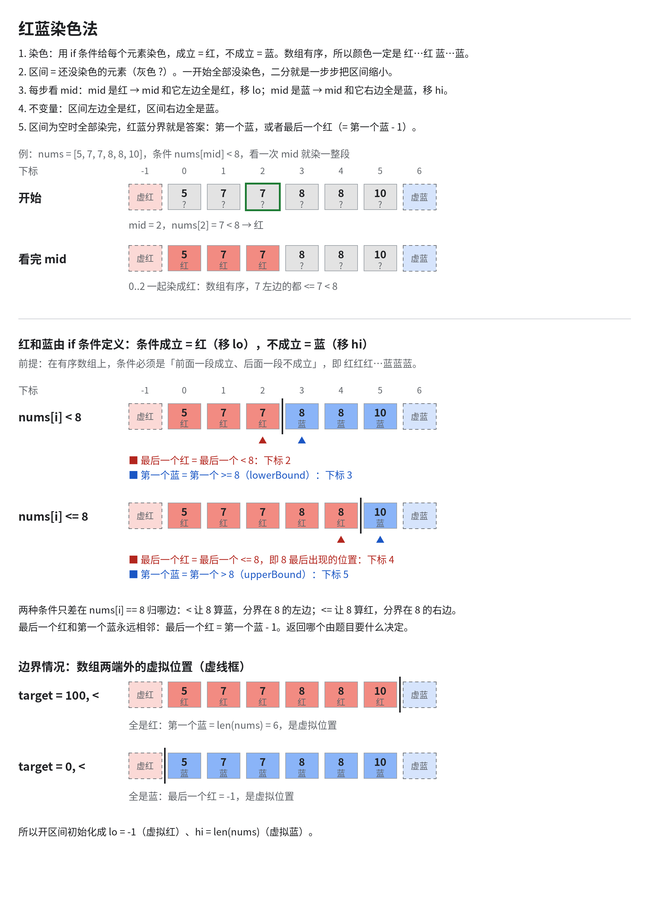
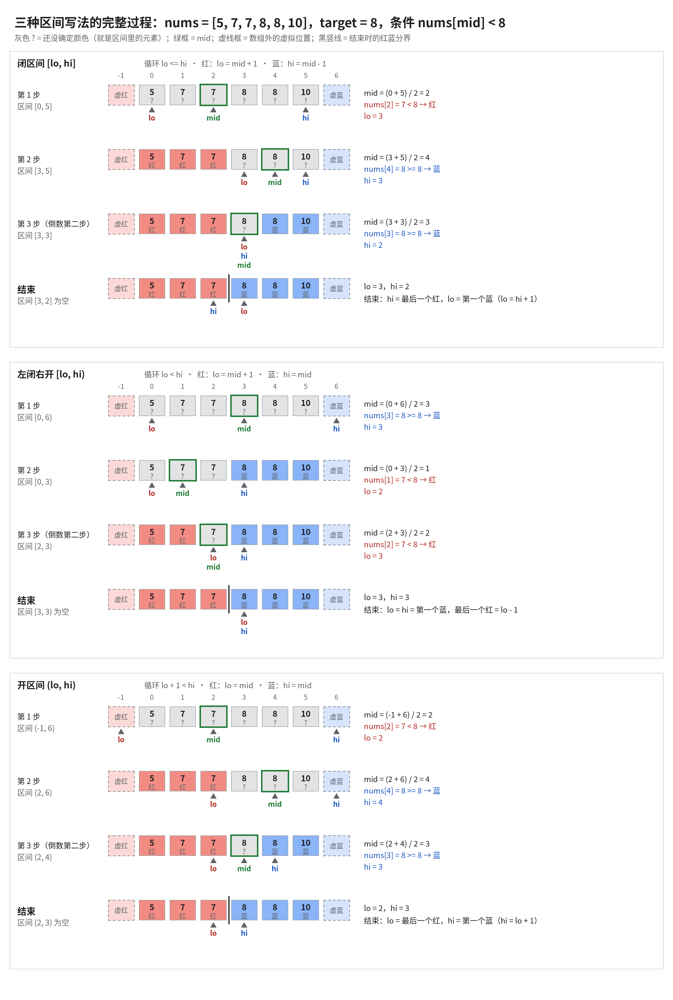

# [34. Find First and Last Position of Element in Sorted Array](https://leetcode.cn/problems/find-first-and-last-position-of-element-in-sorted-array/)

> 难度：Medium

## 题目

Given an array of integers `nums` sorted in non-decreasing order, find the starting and ending position of a given `target` value.

If `target` is not found in the array, return `[-1, -1]`.

You must write an algorithm with `O(log n)` runtime complexity.

**Example 1:**

```
Input: nums = [5,7,7,8,8,10], target = 8
Output: [3,4]
```

**Example 2:**

```
Input: nums = [5,7,7,8,8,10], target = 6
Output: [-1,-1]
```

**Example 3:**

```
Input: nums = [], target = 0
Output: [-1,-1]
```

**Constraints:**

- `0 <= nums.length <= 10^5`
- `-10^9 <= nums[i] <= 10^9`
- `nums` is a non-decreasing array.
- `-10^9 <= target <= 10^9`

<details>
<summary>官方中文题目翻译</summary>

给你一个按照非递减顺序排列的整数数组 `nums`，和一个目标值 `target`。请你找出给定目标值在数组中的开始位置和结束位置。

如果数组中不存在目标值 `target`，返回 `[-1, -1]`。

你必须设计并实现时间复杂度为 `O(log n)` 的算法解决此问题。

**示例 1：**

```
输入：nums = [5,7,7,8,8,10], target = 8
输出：[3,4]
```

**示例 2：**

```
输入：nums = [5,7,7,8,8,10], target = 6
输出：[-1,-1]
```

**示例 3：**

```
输入：nums = [], target = 0
输出：[-1,-1]
```

**提示：**

- `0 <= nums.length <= 10^5`
- `-10^9 <= nums[i] <= 10^9`
- `nums` 是一个非递减数组
- `-10^9 <= target <= 10^9`

</details>

## 题目大意

## 解题思路

1. 遍历数组实现简单，时间复杂度= O(n);递归实现复杂，且时间复杂度= O(n); 都不适合这类题目!
2. 分别计算左界和右界
3. 红蓝染色法
   - 
   - 

### 同类题

## 复杂度

- 时间复杂度：searchRange = O(log(n)); searchRangeRedBlue = O(log(n));
- 空间复杂度：O(1)
